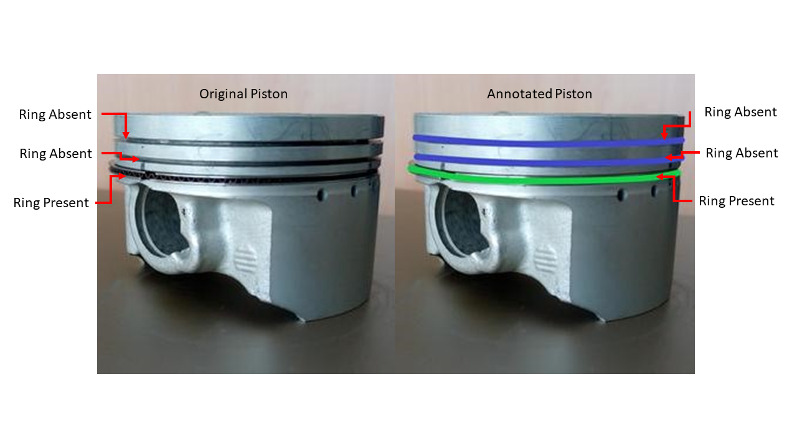
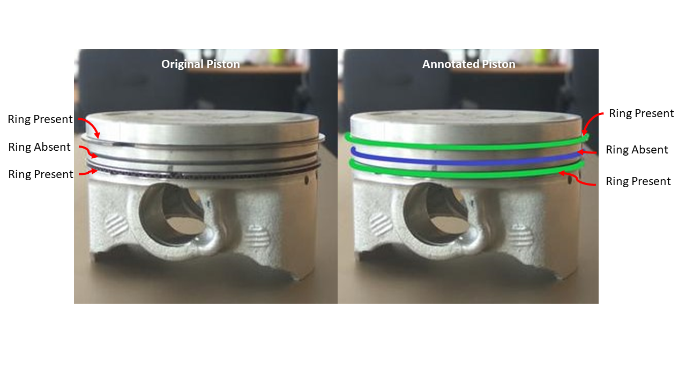
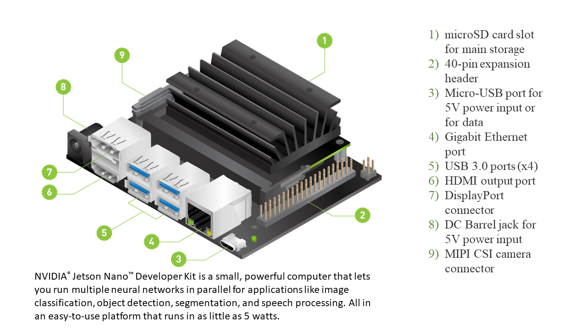
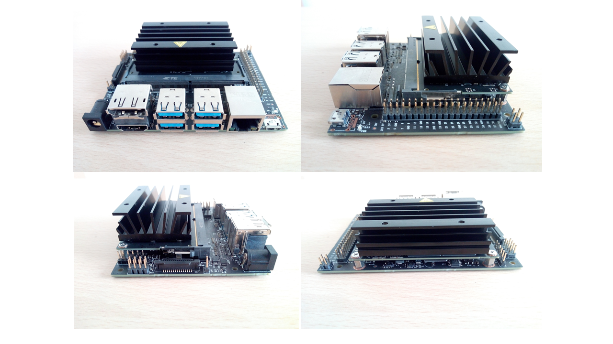
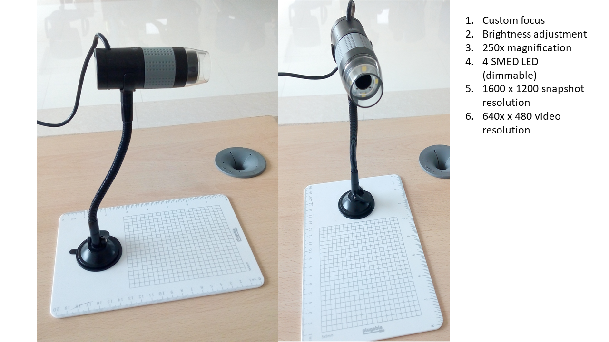

### Piston Ring Detection

This project is designed and developed in CVPR Lab, IIT Ropar, India.

Guide : Dr. Subrahmanyam Murala

Sponsored By : Yamaha Labs, India.

#### Objective
In automatomibe industry, engine assembly is considered as one of the crucial part. 
During engine assenbly various parts assembled together to complate desired two stroke engine. Piston is a part which responsible for the production of stroke which prodce mechanical energy for acceleration. Piston contains various rings depending on different types of engines. During engine assembly, piston without rings can leads to the faulty engine. Due to this it is mandetory to take care of piston rings during engine assembly.

Our project aims the real time detection of the  rings in piston. Our objective is to develope a small device which real time detect piston rings. We consider the fact that the cost of our device should be less than 20,000 INR.

### Approach 
We implement our project with Deep Learning which include Generative Advarserial Network 

### Output Format

### Hardware Used

### Results

Click on Below 

[.gif)](https://www.youtube.com/watch?v=dnUgzh3ULrM)

